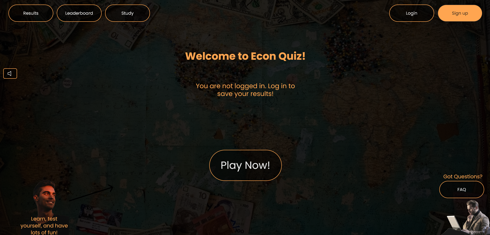
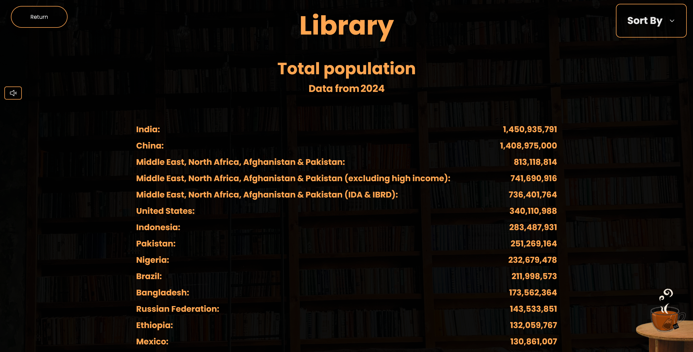
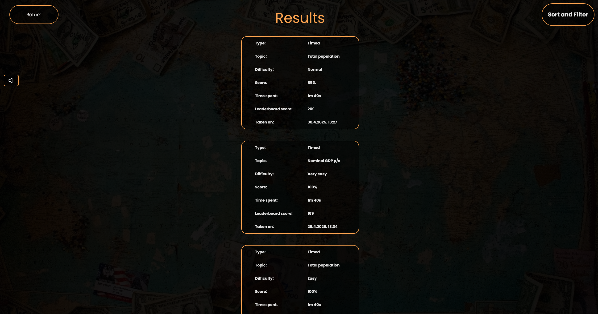
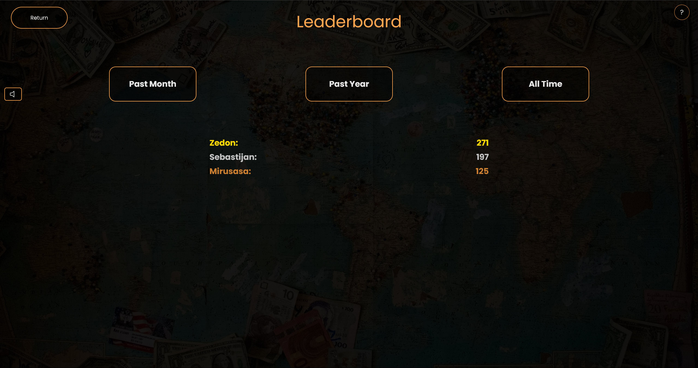
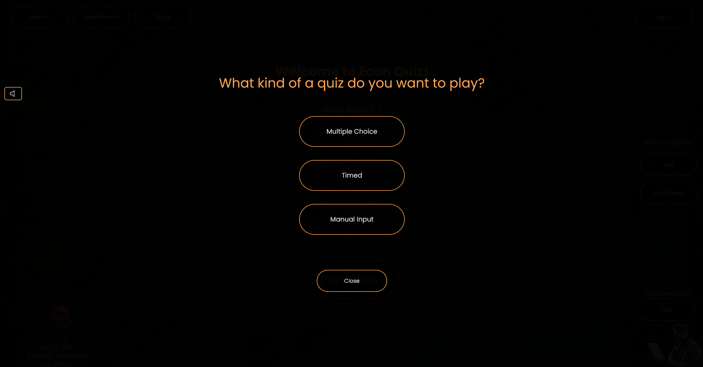
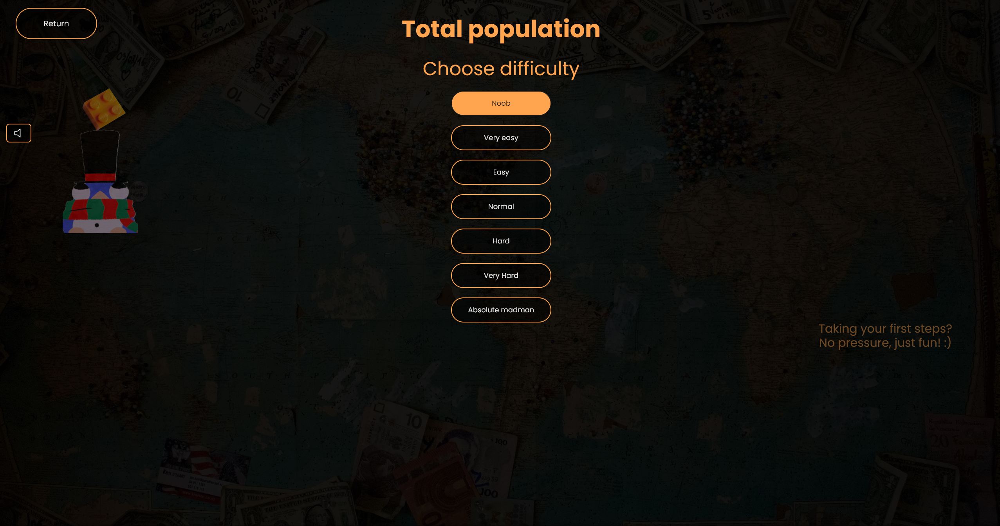
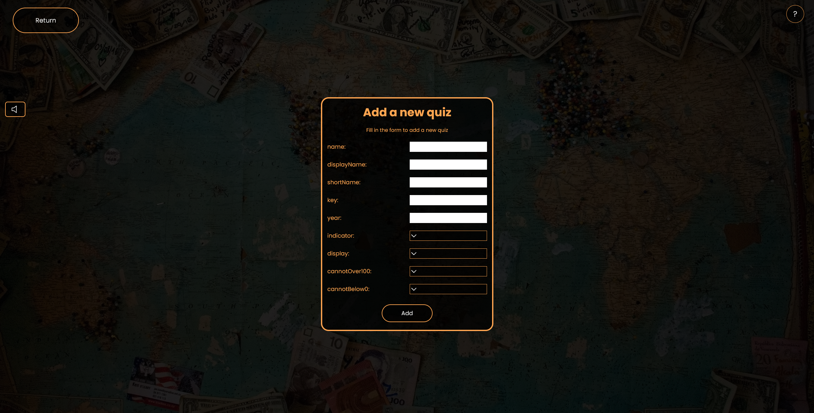
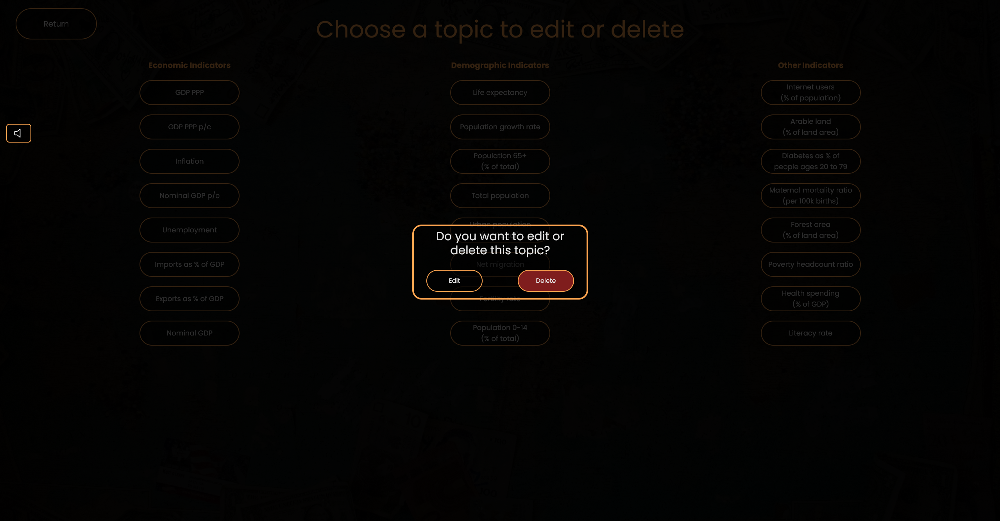

# Econ Quiz

A playful, educational quiz web app that helps users test and improve their knowledge of global economics — GDP, population, and other country-level data.

Econ Quiz is built with modern web tooling and designed to be fast, responsive, and easy to extend. It includes a study mode, leaderboards, results overview, multiple quiz difficulties, quiz types, and quiz topics, user accounts (via Firebase), and an admin interface for adding or editing questions.


## Table of Contents
- [Features](#features)
- [Tech Stack](#tech-stack)
- [Quick Start (local development)](#quick-start-local-development)
- [Project Structure (high level)](#project-structure-high-level)
- [Screenshots](#screenshots)
- [Scripts](#scripts)
- [Design & Assets](#design--assets)
- [License](#license)
- [Contributing](#contributing)
- [Author & Contact](#author--contact)

## Tech Stack

- Frontend: `Vue 3`, `Pinia`, `Vue Router`
- Tooling: `Vite`, `Tailwind CSS`, `PostCSS`
- Backend / Hosting: `Firebase` (Authentication, Firestore, Hosting)
- Languages: `JavaScript` (ES modules)

## Features

- Study mode for each of the topics.
- Topic, difficulty and quiz type selection.
- Fun quizzes with scoring and results screens.
- Leaderboard, results overview, and user accounts (Firebase Authentication + Firestore).
- Admin interface to add, edit, or remove quizzes.
- Responsive UI built with Tailwind CSS and Vite for fast developer feedback.

## Quick Start (local development)

### Prerequisites
- Node.js (16+) with npm

### Clone and navigate to the repository:
```bash
git clone https://github.com/Sebastijan-Dominis/econ-quiz
cd econ-quiz
```

### Install the dependencies
```bash
npm install
```

### Start the server
```bash
npm run dev
```

### Use the app
- You can access it on `http://localhost:5173` in your browser

#### Note
The API key for Firebase is currently hardcoded to enable other developers simple and convenient testing of the code. This may change in the future if it gets abused.

## Project Structure (high level)

- `econ_quiz/` — main application folder
	- `src/` — application source
		- `components/` — Vue components
		- `views/` — route views (Home, Quiz, Study, Admin, etc.)
		- `stores/` — Pinia stores
		- `js/firebase.js` — Firebase initialization
	- `public/` — static assets
	- `package.json` — project scripts & deps
	- `vite.config.js`, `tailwind.config.js`, `postcss.config.js`
- `FIGMA/`, `UML_diagrams_new/` — design and UML diagrams (reference only)

## Screenshots

### Main screen - logged out


### Main screen - logged in


### Study section


### Results section


### Leaderboard section


### Quiz choice


### Quiz topic choice


### Difficulty choice


### Timed quiz question


### Difficulty choice


### Multiple choice quiz question


### Manual input quiz question


### Adding a quiz


### Editing or deleting a quiz


## Scripts

Available scripts (from `econ_quiz/package.json`):

- `npm run dev` — run the dev server with Vite
- `npm run build` — build the production bundle
- `npm run preview` — locally preview the production build
- `npm run deploy` — installs deps, builds, and runs `firebase deploy` (requires Firebase CLI and project configured)

## Design & Assets

The repo includes Figma exports and UML diagrams used during design. These are reference materials and can be large — you can ignore or exclude `FIGMA/` and `UML_diagrams_new/` when cloning if you don't need them.

Design guidelines and inspiration are stored in `econ_quiz/design.md` and include color palettes, typography, and UX notes.

## License

- This repository includes a `LICENSE` file — please review it for terms of reuse.

## Contributing

- There are a few known bugs in this repository. You are welcome to fix them!
- Follow existing code style (Vue 3 + Composition API, Pinia for state), and keep changes focused and well-documented.

## Author & Contact
- Author: Sebastijan Dominis
- Contact: sebastijan.dominis99@gmail.com
